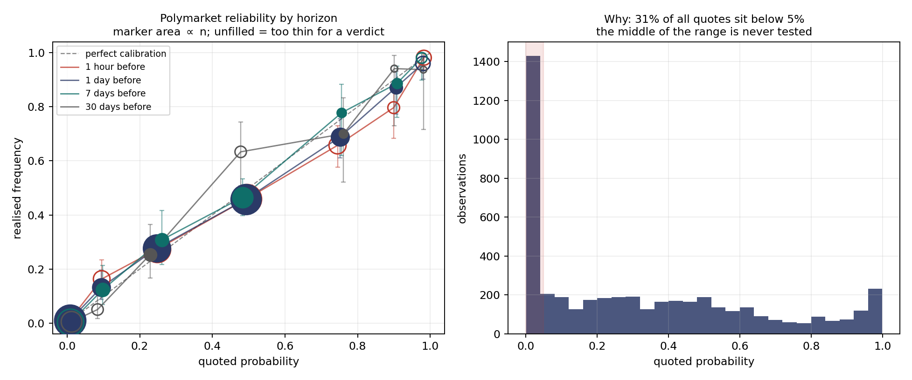

# Are Polymarket prices calibrated probabilities?

A reliability study of resolved Polymarket markets. **1,874 markets, 4,756
quote–outcome pairs**, at one hour, one day, seven days and thirty days before
resolution.



## The question

A prediction-market price is only a probability if it behaves like one: of everything
the market prices at 70 per cent, roughly 70 per cent should happen. That is a
*reliability* question, and it is the same question I ask of my own models' uncertainty
in my PhD, where a multi-seed ensemble claiming 90 per cent coverage was found to
deliver 58.9 per cent, and split conformal prediction repaired it to 94.6 per cent
without retraining. This repository points the same discipline at market prices.

## Correction, 7 September 2026: the first version of this study was wrong

The first version of this study, published 30 August 2026, concluded that **no
probability band is testable in a one-month window**. That conclusion was an artefact
of a bug in my own harvester, not a property of the venue, and it is now withdrawn.

`fetch_markets` paginates Gamma and caught any exception from a page request as a
signal to stop, on the reasoning that Gamma 500s on deep offsets rather than returning
an empty page. It does, but it also 500s *intermittently* at shallow offsets. A
transient failure at offset 300 therefore ended the sweep silently and looked exactly
like a completed one. The harvest reported 300 eligible markets for a window that
actually held 2,100, and every downstream conclusion inherited that 7x undercount.

Two headline claims died with it:

* **"No band is testable in one month" is false.** A single complete 30-day window,
  analysed on its own, already gives a verdict in six of seven bands at the one-day
  horizon, and finds the 65–85 per cent band overpriced there. It was never necessary to accumulate forward to make the middle of the range
  testable; it was necessary to read the whole window.
* **"Half of all quotes sit below five per cent" is false.** That was 53 per cent of
  the truncated sample. In the complete sweep it is 27 per cent at the one-day horizon.
  The longshot skew is real but roughly half the size the first version reported.

The pagination bug is fixed: a failed page is now probed at further offsets before the
sweep is allowed to conclude, unrecovered gaps are recorded, and an incomplete sweep
says so loudly instead of returning a short read that looks complete. The survivorship
figures the analysis prints are now read from `harvest_stats.json` rather than
hard-coded, which is how the stale numbers survived as long as they did.

I have left this section in rather than quietly restating the result, because the
kill was the point of the exercise.

## Headline result

**At one day before resolution the market is well calibrated across the whole range.
At one hour before resolution it is not: the 65–95 per cent bands are measurably
overpriced.**

| Quote taken | n | Brier | reliability ↓ | resolution ↑ | uncertainty | beats base rate by |
|---|---:|---:|---:|---:|---:|---:|
| 30 days before | 466 | 0.0874 | 0.0037 | 0.0980 | 0.1826 | 0.0951 |
| 7 days before | 843 | 0.1059 | 0.0004 | 0.1024 | 0.2072 | 0.1013 |
| 1 day before | 1,792 | 0.1423 | 0.0010 | 0.0807 | 0.2225 | 0.0803 |
| 1 hour before | 1,655 | 0.1474 | 0.0019 | 0.0787 | 0.2260 | 0.0786 |

The reliability component is small against the uncertainty term at every horizon, so
there is little gross miscalibration, and resolution is large, so the prices carry real
information.

**Do not read the Brier column across rows.** It rises as resolution approaches, which
looks like the market getting worse and is not. Different markets survive at different
horizons: only 466 observations have a quote a full 30 days out, and those are
long-dated questions with a lower base rate. The uncertainty term rises from 0.1826 to
0.2260 across the same rows, which is the sample composition changing, not skill
degrading. Compare reliability within a horizon, not Brier across horizons. The first
version of this study read a monotonic fall in Brier as evidence of an efficient market
sharpening toward resolution; on the complete sample that pattern does not exist.

## Where the market is miscalibrated

At **one day** before resolution, every band from 0–5 to 85–95 per cent is consistent
with its quote. That is a genuinely well-calibrated book.

At **one hour** before resolution it is not:

```
RELIABILITY -- quote taken 1 hour before resolution   (n = 1655)
   quoted band     n  mean quote  realised           95% CI   verdict
         0%-5%   422       0.6%      0.9% [ 0.4%,  2.4%]   n ok but only 4 of the rarer outcome -- no verdict
        5%-15%   135       9.5%     16.3% [11.0%, 23.4%]   market UNDERPRICED this band
       15%-35%   352      24.8%     27.3% [22.9%, 32.2%]   consistent with the quote
       35%-65%   431      49.5%     45.9% [41.3%, 50.7%]   consistent with the quote
       65%-85%   143      74.5%     65.7% [57.6%, 73.0%]   market OVERPRICED this band
       85%-95%    64      89.9%     79.7% [68.3%, 87.7%]   market OVERPRICED this band
      95%-100%   108      98.2%     98.1% [93.5%, 99.5%]   n ok but only 2 of the rarer outcome -- no verdict
```

Longshots at 5–15 per cent come in more often than quoted, and favourites at 65–95 per
cent come in less often than quoted. That is the classic favourite–longshot bias, and
it appears in the last hour rather than being present throughout. It is worth saying
plainly that this is the opposite of what a naive efficiency story predicts, since the
last hour is when the least should be unknown.

Two cautions before anyone reads that as an edge. The one-hour and one-day samples are
largely the same markets, so these are not independent measurements of the same book at
two times. And the effect sits in mid-quotes; at 65–85 per cent a 9-point gap is large
against a typical spread, but nothing here models spread, fees or fill.

## Two sample-size rules, and why both are needed

1. **n ≥ 30 per band.** Coverage is a proportion estimated from n points and carries
   its own uncertainty; below about thirty, the Wilson interval is wider than any
   effect worth detecting.
2. **≥ 5 of each outcome per band.** This one still does most of the work at the tails.
   It caught a false positive in an earlier version of this analysis: the 0–5 per cent
   band at the one-hour horizon had n = 107 and *looked* significantly underpriced,
   0.49 per cent quoted against 1.87 per cent realised, with a Wilson lower bound
   clearing the mean quote by 0.02 percentage points. But k = 2. The entire result
   rested on two markets resolving Yes. The rule refuses a verdict on any band with
   fewer than five of the rarer outcome, and on the current sample it still withholds a
   verdict on both extreme bands at three of four horizons.

## Limitations, stated because they bound the conclusion

1. **Rolling ~30-day window.** The CLOB price-history endpoint serves history only for
   recently closed markets. Measured on samples of eight markets per month: closed in
   Aug 2026 → history for 8/8; Jul 2026 → 0/8; Jun 2026 → 0/8. This is a moving window,
   not an archive, so the dataset grows *forward* by re-running, never backward. This
   is why the harvest runs weekly even though one window is now known to be sufficient
   for most bands: a week not harvested is permanently lost.
2. **Survivorship.** 295 of 2,100 eligible markets in the 7 Sep harvest were dropped
   for lack of served history, and 16 for not settling to a clean binary. The history
   drop depends on closing date rather than on size, but it has not been proven
   harmless.
3. **Observations are not independent.** Several markets typically belong to one event
   ("who will be X") and are mutually exclusive, so the effective sample is smaller than
   the row count and every interval here is optimistic. This matters more now that
   bands carry verdicts than it did when nothing was testable.
4. **Mid-quotes, not executable prices.** Spread and fees are not modelled; nothing here
   is a tradable edge.
5. **Polymarket only.** Kalshi was tried first and its API is not reachable from a UK
   connection (TLS handshake failure), so no cross-venue comparison is claimed.

## What would actually answer the question

The middle bands are now testable, so the open question has moved. It is no longer
"is there enough data" but "is the one-hour distortion stable". Accumulating further
weeks lets the 65–95 per cent overpricing be re-measured on disjoint samples, which is
the test that would separate a persistent structural bias from one month of noise.
`harvest.py` is written to be re-run weekly and appended.

## Running it

```bash
python3 harvest.py --days 30 --min-volume 10000   # -> observations.csv, markets.csv, harvest_stats.json
python3 analyse.py                                # -> results.txt, reliability.png
```

No dependencies beyond the standard library, except matplotlib for the figure.

## Files

| File | What it is |
|---|---|
| `harvest.py` | Pulls resolved markets and the price path preceding them; documents the API constraints it works around and the pagination failure mode it now guards against |
| `analyse.py` | Reliability bands with Wilson intervals, Brier score with Murphy decomposition, both sample-size rules |
| `observations.csv` | One row per (market, horizon): quoted probability, realised outcome |
| `markets.csv` | One row per market: question, category, volume, settlement |
| `harvest_stats.json` | Eligible/kept/dropped counts from the most recent harvest |
| `results.txt` | Full output of the analysis |
| `reliability.png` | The figure above |
