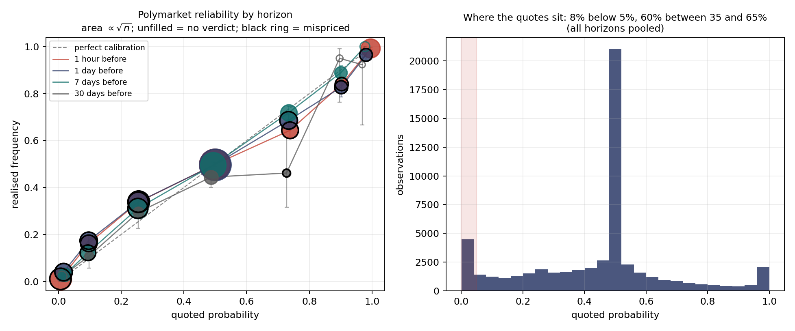

# Are Polymarket prices calibrated probabilities?

A reliability study of resolved Polymarket markets. The headline sample is **three complete,
tiled weeks of resolutions, 6 to 27 September 2026: 25,581 markets and 55,623 quote–outcome
pairs**, at one hour, one day, seven days and thirty days before resolution.



## The question

A prediction-market price is only a probability if it behaves like one: of everything
the market prices at 70 per cent, roughly 70 per cent should happen. That is a
*reliability* question, and it is the same question I ask of my own models' uncertainty
in my PhD, where a multi-seed ensemble claiming 90 per cent coverage was found to
deliver 58.9 per cent, and split conformal prediction repaired it to 94.6 per cent
without retraining. This repository points the same discipline at market prices.

## Headline result

**Away from even odds, Polymarket prices are too extreme.** Markets quoted at 5 to 35
per cent resolve Yes more often than quoted, and markets quoted at 65 to 95 per cent
less often, at both one day and one hour before resolution; at one hour the 0 to 5 per cent band
now joins them. The 35 to 65 per cent band,
which holds most of the book, is consistent with its quotes.

This replaces two earlier headlines, both withdrawn below. It now rests on three complete,
consecutive weeks, and the shape held across the second and third weeks without being
softened away; two weeks was the minimum this study had set itself before calling the
pattern persistent. It still comes with a caution that may yet kill it: noisy quotes produce
exactly this shape on their own (see *What could explain it*).

| Quote taken | n | Brier | reliability ↓ | resolution ↑ | uncertainty | beats base rate by |
|---|---:|---:|---:|---:|---:|---:|
| 30 days before | 909 | 0.1910 | 0.0044 | 0.0399 | 0.2261 | 0.0351 |
| 7 days before | 10,700 | 0.2093 | 0.0008 | 0.0353 | 0.2473 | 0.0380 |
| 1 day before | 21,809 | 0.2213 | 0.0016 | 0.0269 | 0.2480 | 0.0267 |
| 1 hour before | 22,205 | 0.1886 | 0.0014 | 0.0600 | 0.2479 | 0.0593 |

**Do not read the Brier column across rows.** Different markets survive at different
horizons (only 909 have a quote a full 30 days out, because the price-history window
itself is about 30 days), so the rows are different samples. Compare reliability within
a horizon, not Brier across horizons.

Resolution is much lower than in the earlier, truncated sample. That is composition,
not a worse market: the complete weeks are dominated by short-dated Bitcoin up/down,
football and esports markets quoted near 50 per cent, which carry little information a
day out by construction.

## What the third week bought, 27 September 2026

The third complete week (19 to 27 September, an eight-day harvest tiled against the second
with a one-day overlap deduplicated on market and horizon) added 8,822 markets and 18,809
quote–outcome pairs. The harvest found 10,078 eligible markets in eight days, in line with
the previous week's 8,764 in seven, so it was not truncated.

**The band flagged in advance has now been decided.** On 20 September the 65 to 85 per cent
band at thirty days read 74.1 per cent quoted against 39.1 per cent realised on n = 23, below
the floor, and was put on the record as the one to watch before the sample could settle it.
It has now cleared both sample-size rules, and the gap held:

```
RELIABILITY -- quote taken 30 days before resolution   (n = 909)
     quoted band     n  mean quote  realised           95% CI   verdict
           0%-5%   142       1.1%      2.1% [ 0.7%,  6.0%]   n ok but only 3 of the rarer outcome -- no verdict
          5%-15%    74       9.8%     10.8% [ 5.6%, 19.9%]   consistent with the quote
         15%-35%   146      25.4%     29.5% [22.7%, 37.3%]   consistent with the quote
         35%-65%   475      48.7%     44.4% [40.0%, 48.9%]   consistent with the quote
         65%-85%    39      72.7%     46.2% [31.6%, 61.4%]   market OVERPRICED this band
         85%-95%    20      89.7%     95.0% [76.4%, 99.1%]   too few to judge (n<30)
        95%-100%    13      96.8%     92.3% [66.7%, 98.6%]   too few to judge (n<30)
```

The Wilson interval assumes 39 independent markets, and they are not: six are Emmys
categories on one night, three are over/under lines on one Rays–Yankees game (all three
resolved No together), three are the Swedish election. Grouping the 39 into 24 events and
resampling events rather than markets, the quote-minus-outcome gap of 26.6 points has a
95 per cent cluster-bootstrap interval of 9.3 to 43.5 points. It still excludes zero, so the
verdict survives the obvious objection. It is also the direction of the headline
(favourites overpriced), and the largest single miscalibration in the study, so it deserves
the most suspicion: 24 events is a small number, and the grouping was done by hand.

**The thirty-day low bands stayed consistent** (5 to 15 and 15 to 35 per cent), so at a month
out the overshoot is visible on the favourite side but not yet on the longshot side.

**Two more bands moved.** At seven days the 0 to 5 per cent band cleared the rarer-outcome
rule (12 Yes of 419) and reads consistent with the quote. At one hour the 0 to 5 per cent
band flipped from consistent to *underpriced* (0.6 per cent quoted, 1.1 per cent realised,
n = 2,900), so the one-hour longshot side now matches the one-day side all the way down.

## What the second week bought, 20 September 2026

The second complete week (12 to 20 September, tiled against the first with a one-day
overlap deduplicated on market and horizon) roughly doubled every horizon. Two things
changed that are worth stating separately from the headline.

**The thirty-day horizon became partly testable.** It was the thinnest horizon in the
one-week sample, with n = 167 and a verdict in exactly one band. It now holds n = 498,
and the 5 to 15 and 15 to 35 per cent bands have cleared both sample-size rules for the
first time:

```
RELIABILITY -- quote taken 30 days before resolution   (n = 498)
     quoted band     n  mean quote  realised           95% CI   verdict
           0%-5%   109       1.1%      1.8% [ 0.5%,  6.4%]   n ok but only 2 of the rarer outcome -- no verdict
          5%-15%    48      10.5%     14.6% [ 7.2%, 27.2%]   consistent with the quote
         15%-35%    84      24.5%     32.1% [23.1%, 42.7%]   consistent with the quote
         35%-65%   206      48.0%     49.5% [42.8%, 56.3%]   consistent with the quote
         65%-85%    23      74.1%     39.1% [22.2%, 59.2%]   too few to judge (n<30)
         85%-95%    16      89.5%    100.0% [80.6%,100.0%]   too few to judge (n<30)
        95%-100%    12      96.8%     91.7% [64.6%, 98.5%]   too few to judge (n<30)
```

Both verdicts are *consistent with the quote*. That is a real result and it cuts against
the headline: the overshoot toward the extremes that is clear a day and an hour out is
not yet visible a month out, where the same bands sit inside their intervals. The
intervals at thirty days are still wide enough that a one-day-sized effect would fit
inside them, so this is not yet evidence the effect is absent at long horizons, only that
it has not appeared.

The 65 to 85 band at thirty days is the one to watch: 74.1 per cent quoted against 39.1
per cent realised, which would be the largest miscalibration anywhere in the study, on
n = 23. It is below the n floor and gets no verdict. Two more weeks should settle it, and
I am flagging it now so that it is on the record before the sample decides it, rather
than after.

**One band flipped at seven days.** The 5 to 15 per cent band moved from *consistent*
(n = 292) to *underpriced* (n = 612), which extends the one-day shape one horizon further
out.

## Correction, 12 September 2026: the sample was not the venue

The 7 September version of this study fixed one truncation and missed a second, larger
one. Its headline, that the market is well calibrated at one day and overpriced at
65 to 95 per cent in the last hour, described a sample that does not represent
Polymarket. That headline is withdrawn.

**What was wrong.** Gamma refuses any `offset` of 2,100 or more with HTTP 422. A window
holding more than 2,100 matching markets therefore returns exactly the first 2,100 and
then errors, and the pagination guard added on 7 September read that hard refusal as the
end of the data. Every harvest reported exactly 2,100 eligible markets, which should
have been the giveaway.

**Why it was not harmless.** Gamma returns markets in ascending id order, so the 2,100
were not a random subsample. They were the lowest-id, earliest-created markets in the
window. Measured on 12 September:

* A single 24-hour slice holds about 1,100 eligible markets, and a complete 7-day harvest
  found 8,595, so a 30-day window holds more than 30,000. The harvest saw about 6 to 7
  per cent of it.
* For the day 9 to 10 September, the complete enumeration has 1,227 markets. The
  truncated harvest captured **6** of them.
* The populations differ in kind. The complete day is dominated by short-dated recurring
  markets (Bitcoin price, football, CS2, MLS, ATP tennis) with median volume $35,896.
  The six captured were long-lived "who will" and "will" questions with median volume
  $172,844.

So the 7 September result, and the cumulative series below it, is a statement about
long-lived, early-created, high-volume questions. It may be a true statement about
those, but it is not a statement about the venue.

**The fix.** `fetch_markets` now splits the window recursively until every slice
completes on its own terms rather than against the offset cap, and deduplicates on
market id across slice boundaries. A slice that still hits the cap at the 15-minute
floor is reported as truncated. The harvest now also survives a network drop instead of
losing the run; it did not, the first time the complete harvest was attempted.

This is the second time the same function has silently under-read the window, by a
different mechanism each time, and both times the short read looked complete. The
lesson I am taking is that a sweep has to be checked against an independent count, not
just against its own error handling.

## Correction, 7 September 2026: the first version of this study was wrong

The first version of this study, published 30 August 2026, concluded that **no
probability band is testable in a one-month window**. That conclusion was an artefact
of a bug in my own harvester, not a property of the venue, and it is now withdrawn.

`fetch_markets` paginates Gamma and caught any exception from a page request as a
signal to stop, on the reasoning that Gamma 500s on deep offsets rather than returning
an empty page. It does, but it also 500s *intermittently* at shallow offsets. A
transient failure at offset 300 therefore ended the sweep silently and looked exactly
like a completed one. The harvest reported 300 eligible markets for a window that
actually held 2,100, and every downstream conclusion inherited that 7x undercount.

Two headline claims died with it:

* **"No band is testable in one month" is false.** A single complete 30-day window,
  analysed on its own, already gives a verdict in six of seven bands at the one-day
  horizon, and finds the 65–85 per cent band overpriced there. It was never necessary to accumulate forward to make the middle of the range
  testable; it was necessary to read the whole window.
* **"Half of all quotes sit below five per cent" is false.** That was 53 per cent of
  the truncated sample. In the complete sweep it is 27 per cent at the one-day horizon.
  The longshot skew is real but roughly half the size the first version reported.

The pagination bug is fixed: a failed page is now probed at further offsets before the
sweep is allowed to conclude, unrecovered gaps are recorded, and an incomplete sweep
says so loudly instead of returning a short read that looks complete. The survivorship
figures the analysis prints are now read from `harvest_stats.json` rather than
hard-coded, which is how the stale numbers survived as long as they did.

I have left this section in rather than quietly restating the result, because the
kill was the point of the exercise.

## Where the market is miscalibrated

```
RELIABILITY -- quote taken 1 day before resolution   (n = 21809)
     quoted band     n  mean quote  realised           95% CI   verdict
           0%-5%  1260       1.6%      4.0% [ 3.0%,  5.2%]   market UNDERPRICED this band
          5%-15%  1217       9.6%     17.3% [15.3%, 19.6%]   market UNDERPRICED this band
         15%-35%  2957      25.6%     34.0% [32.3%, 35.7%]   market UNDERPRICED this band
         35%-65% 14365      49.9%     49.8% [48.9%, 50.6%]   consistent with the quote
         65%-85%  1302      73.4%     68.6% [66.0%, 71.1%]   market OVERPRICED this band
         85%-95%   370      90.1%     82.7% [78.5%, 86.2%]   market OVERPRICED this band
        95%-100%   338      98.1%     96.4% [93.9%, 98.0%]   market OVERPRICED this band
```

```
RELIABILITY -- quote taken 1 hour before resolution   (n = 22205)
     quoted band     n  mean quote  realised           95% CI   verdict
           0%-5%  2900       0.6%      1.1% [ 0.8%,  1.5%]   market UNDERPRICED this band
          5%-15%  1024       9.7%     16.2% [14.1%, 18.6%]   market UNDERPRICED this band
         15%-35%  2370      25.4%     33.7% [31.8%, 35.6%]   market UNDERPRICED this band
         35%-65% 12685      49.9%     49.8% [49.0%, 50.7%]   consistent with the quote
         65%-85%  1041      73.9%     64.4% [61.4%, 67.2%]   market OVERPRICED this band
         85%-95%   388      90.3%     84.0% [80.0%, 87.3%]   market OVERPRICED this band
        95%-100%  1797      99.5%     99.3% [98.8%, 99.6%]   consistent with the quote
```

**By market family** (computed on the two-week sample of 20 September and not yet
re-run on three weeks). About 5,800 of the 14,400 observations at the one-day horizon then were
crypto price markets, nearly all quoted between 35 and 65 per cent. Excluding them
leaves the shape intact, so it is not a Bitcoin artefact:

| 1 day before, crypto excluded | n | mean quote | realised | 95% CI | verdict |
|---|---:|---:|---:|---|---|
| 0–5% | 684 | 1.8% | 4.1% | [2.8%, 5.9%] | underpriced |
| 5–15% | 838 | 9.5% | 17.7% | [15.2%, 20.4%] | underpriced |
| 15–35% | 1,976 | 25.6% | 32.7% | [30.7%, 34.8%] | underpriced |
| 35–65% | 3,942 | 49.1% | 51.8% | [50.2%, 53.3%] | underpriced |
| 65–85% | 836 | 73.4% | 68.1% | [64.8%, 71.1%] | overpriced |
| 85–95% | 225 | 90.2% | 84.9% | [79.6%, 89.0%] | overpriced |
| 95–100% | 120 | 97.1% | 92.5% | [86.4%, 96.0%] | overpriced |

The 35 to 65 band crosses into "underpriced" here for the first time, but on a 2.7
point gap with a lower bound 1.1 points clear of the mean quote. On a sample this size
almost any real asymmetry will clear the interval, and this one is small enough that I
would not report it as a finding separate from the overall shape.

Within that, sports and esports markets show it most strongly: at one day every band
from 5 to 100 per cent is miscalibrated in this direction except 35 to 65. The crypto markets on their own look slightly overpriced in the
35 to 65 band (50.4 per cent quoted, 47.6 per cent realised), but that is "Up" resolving
less often than priced during one week of Bitcoin, which is a single correlated draw, not
a calibration finding.

The 7 September version called its (smaller, truncated) version of this pattern "the
classic favourite–longshot bias". That label was backwards. The classic bias in betting
markets is longshots *overpriced*; here longshots are *underpriced* and favourites
overpriced, which is prices overshooting toward the extremes.

## What could explain it

1. **Quote noise, which would make it an artefact.** If a quote is the true probability
   plus noise, bucketing by the noisy quote sends markets with positive noise into the
   high bands and negative noise into the low bands, and outcomes then regress toward the
   middle. That is exactly this shape, with no mispricing at all. Hourly mid-quotes on
   thin books, and sports markets quoted mid-game, are noisy. This explanation has not
   been ruled out and is the first thing to test.
2. **Genuine overreaction** in fast-moving, retail-heavy markets, which would be a real
   and possibly persistent effect.

Separating them needs quotes that are less noisy for the same markets: finer history
fidelity, time-averaged quotes around each horizon, or executed trade prices. If the
shape shrinks as the quote gets cleaner, it was noise.

## Two sample-size rules, and why both are needed

1. **n ≥ 30 per band.** Coverage is a proportion estimated from n points and carries
   its own uncertainty; below about thirty, the Wilson interval is wider than any
   effect worth detecting.
2. **≥ 5 of each outcome per band.** This one still does most of the work at the tails.
   It caught a false positive in an earlier version of this analysis: the 0–5 per cent
   band at the one-hour horizon had n = 107 and *looked* significantly underpriced,
   0.49 per cent quoted against 1.87 per cent realised, with a Wilson lower bound
   clearing the mean quote by 0.02 percentage points. But k = 2. The entire result
   rested on two markets resolving Yes. The rule refuses a verdict on any band with
   fewer than five of the rarer outcome, and on the current sample it still withholds a
   verdict on the 0 to 5 band at thirty days (n = 142, k = 3) and the 95 to 100 band at
   seven days. That band now has n = 110 and would look decisively well calibrated on n
   alone; it has zero of the rarer outcome, so it gets no verdict.

## The earlier, truncated series

`observations.csv` and `markets.csv` hold the merged harvests of 30 August, 7 September
and 12 September: **2,990 markets, 7,121 quote–outcome pairs**. Every one of those
harvests was truncated, so the series describes long-lived, early-created, high-volume
questions rather than the venue. It is kept, frozen, because it is the sample the
withdrawn results were computed on, and because as a description of that subpopulation
it may still be useful. It cannot be extended: the fixed harvester no longer reproduces
the truncation. Its output is in `results_truncated_series.txt` and
`reliability_truncated.png`.

## Limitations, stated because they bound the conclusion

1. **Three weeks.** The headline rests on three complete, consecutive weeks of resolutions.
   The second week was the minimum this study set for calling the shape persistent, and
   the shape held through the third. Consecutive is not the same as independent, though: the weeks share
   the same recurring market families and much of the same news flow, so this is weaker
   evidence than weeks drawn months apart would be.
2. **Rolling ~30-day window.** The CLOB price-history endpoint serves history only for
   recently closed markets (measured 30 August 2026 on samples of eight: August 8/8,
   July 0/8, June 0/8). Data cannot be back-filled; a week not harvested is lost.
3. **Survivorship is now small.** In the most recent harvest (eight days), of 10,078
   eligible markets 58 were dropped for not settling to a clean binary, 1 for lack of
   served history, and none to a network failure. The two weeks before, of 8,764 and
   8,595 eligible, the figures were 31, 6, 1 and 39, 8, 1.
4. **Observations are not independent.** Crypto up/down markets on the same underlying
   and hour move together, and sports markets on one fixture are mutually exclusive, so
   the effective sample is far smaller than the row count and every interval here is
   optimistic.
5. **Mid-quotes, not executable prices.** Spread and fees are not modelled; nothing here
   is a tradable edge.
6. **Resolution time is `endDate`.** Horizons are measured back from the listed end date,
   which for some sports markets is not the moment the outcome became known.
7. **Polymarket only.** Kalshi's API is not reachable from a UK connection (TLS handshake
   failure), so no cross-venue comparison is claimed.

## Running it

```bash
python3 harvest.py --days 7 --min-volume 10000 --out observations_complete_$(date +%Y%m%d).csv --markets-out markets_complete_$(date +%Y%m%d).csv
# merge into observations_complete.csv / markets_complete.csv, deduplicating on (market_id, horizon_hours)
python3 analyse.py --obs observations_complete.csv --markets markets_complete.csv > results.txt
```

Run weekly with `--days 7` so consecutive harvests tile the timeline (or `--days 8` for a
one-day overlap, which the merge deduplicates; the 27 September harvest did this). Check the eligible
count against the previous week before merging: the harvest on 19 September ended at
offset 1,000 on a transient network failure and returned 900 eligible against the
previous week's 8,595. It said so in a `WARNING` line and its counts were a lower bound,
but a tenth of the expected volume is the cheaper check. That harvest was discarded and
re-run rather than merged. With the offset cap
handled, a 30-day window is more than 30,000 markets and several hours of history requests;
a 7-day window is about 8,600 markets and a little over an hour.

No dependencies beyond the standard library, except matplotlib for the figure.

## Files

| File | What it is |
|---|---|
| `harvest.py` | Pulls resolved markets and their price paths; splits the window to get under Gamma's offset cap, and documents both truncation failures |
| `analyse.py` | Reliability bands with Wilson intervals, Brier score with Murphy decomposition, both sample-size rules |
| `observations_complete.csv`, `markets_complete.csv` | The complete sample (headline) |
| `observations.csv`, `markets.csv` | The earlier truncated series, frozen |
| `*_YYYYMMDD.csv` | Raw output of each individual harvest |
| `harvest_stats.json` | Eligible/kept/dropped counts from the most recent harvest |
| `results.txt`, `reliability.png` | Analysis of the complete sample |
| `results_truncated_series.txt`, `reliability_truncated.png` | Analysis of the truncated series |
